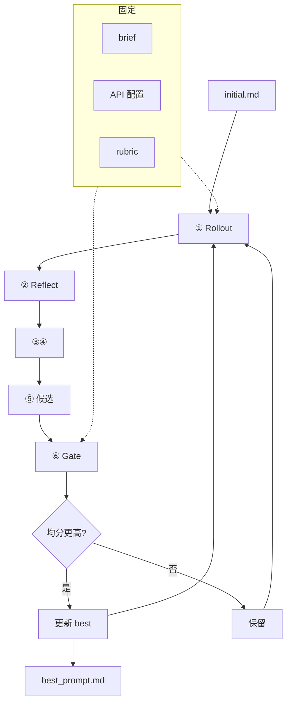

# prompt-opt：T2I Prompt 优化（SkillOpt / Direct）

Fork [Microsoft SkillOpt](https://github.com/microsoft/SkillOpt)，**Reflect + Gate**，**固定 brief → 最优 T2I prompt**。

[](https://www.python.org/) [](LICENSE)

**快照分支：** `backup/pre-t2i-direct`

---

## 术语

| 概念 | 键 / 产物 | 说明 |
|------|-----------|------|
| **prompt** | `prompt_init`、`prompts/prompt_vNNNN.md` | 优化对象，T2I 正文 |
| **best prompt** | `best_prompt.md` | 验收通过的历史最优 |
| **brief** | `data/.../*.json` | 固定业务约束，不改 |
| **rubric** | 适配器打分逻辑 | 审美维度 → `hard`/`soft` |
| **API 配置** | `.env`、`configs/` | T2I / LLM / VLM endpoint，非 prompt 正文 |
| **train_runs** | `env.train_runs` | Rollout 重复出图次数（无 seed） |
| **gate_runs** | `env.gate_runs` | Gate 验收重复出图次数 |

| YAML（结构化） | 扁平（trainer） |
|----------------|-----------------|
| `env.prompt_init` | `prompt_init` |
| `optimizer.prompt_update_mode` | `prompt_update_mode` |
| `optimizer.use_meta_prompt` | `use_meta_prompt` |
| `env.best_prompt_file` | `best_prompt_file` |
| `env.prompt_version_dir` | `prompt_version_dir` |
| `env.prompt_version_prefix` | `prompt_version_prefix` |

| 不改名 | 原因 |
|--------|------|
| Python 包 `skillopt` | 上游 fork 根包名 |
| 目录 `skillopt/prompts/` | Optimizer LLM 模板，`load_prompt(name)` |
| `codex_harness` 内 SKILL.md | Codex 工作区约定，非 T2I prompt |

---

## 设计结论

| 议题 | 结论 |
|------|------|
| 模式 | **direct**：优化 prompt 正文 |
| meta | TODO；首版不做 |
| 随机性 | 无 seed；`train_runs` / `gate_runs` 多次调用取均分 |
| 初始 prompt | 必填 `prompt_init` |
| 收敛 | 无 loss / 早停；看 `best_score` |

---

## Direct 流程



| 阶段 | 含义 |
|------|------|
| ① | 当前 prompt × `train_runs` → 均分 |
| ② | 低分 → patches |
| ③④ | 合并；`edit_budget` |
| ⑤ | 候选 prompt |
| ⑥ | 候选 × `gate_runs`；高于 current 才 accept |

---

## 模式 / 上游

| 模式 | 优化对象 | 状态 |
|------|----------|------|
| direct | prompt | **当前** |
| meta | 写 prompt 规则 | TODO |

| | 上游 SkillOpt | 本项目 |
|--|---------------|--------|
| 对象 | Agent Skill | T2I **prompt** |
| 产物 | `best_skill.md` | **`best_prompt.md`** |
| 版本目录 | `skills/` | **`prompts/`** |

---

## 配置与目录

| 路径 | 职责 |
|------|------|
| `configs/t2i/default.yaml` | `prompt_init`、`train_runs`、`gate_runs` |
| `skillopt/envs/t2i/prompts/initial.md` | 初始 prompt |
| `skillopt/envs/t2i/` | adapter（待实现） |
| `skillopt/engine/trainer.py` | ReflACT 主循环 |
| `skillopt/optimizer/prompt_editor.py` | patch 应用 |

```
outputs/<run>/
├── best_prompt.md
├── prompts/prompt_v0001.md
└── steps/step_XXXX/
```

---

## 运行

```bash
pip install -e . && cp .env.example .env
python scripts/train.py --config configs/t2i/default.yaml \
  --split_dir data/t2i_split --out_root outputs/t2i_run
```

| CLI | 说明 |
|-----|------|
| `--prompt_init` | 初始 prompt |
| `--prompt_update_mode` | `patch` / `rewrite_from_suggestions` / … |
| `--use_meta_prompt` | 跨 epoch 优化器记忆 |

```bash
python scripts/eval_only.py --config configs/t2i/default.yaml \
  --prompt skillopt/envs/t2i/prompts/initial.md --out_root outputs/eval
```

---

## 踩坑

| 问题 | 处理 |
|------|------|
| 旧 `best_skill.md` | 续训可读；新 run 写 `best_prompt.md` |
| 旧 `runtime_state` 键 | 兼容读 `current_skill_path` / `best_skill_path` |
| 旧 `meta_skill/` 目录 | 兼容读；新 run 用 `meta_prompt/` |
| 无 `prompt_init` | 必填 |

---

## 上游

[SkillOpt](https://github.com/microsoft/SkillOpt) · `backup/archive/`
