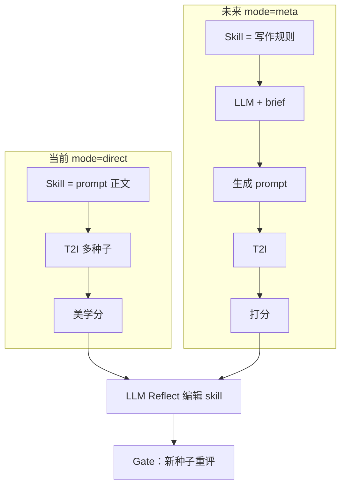
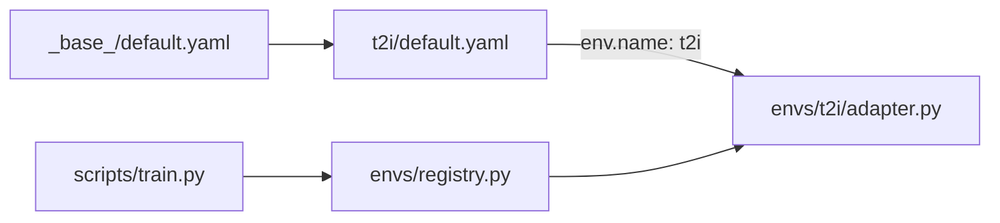

# prompt-opt：基于 SkillOpt 的 T2I Prompt 优化

*Fork 自 [Microsoft SkillOpt](https://github.com/microsoft/SkillOpt)。保留 Reflect + Gate 训练循环，面向文生图（T2I）prompt 的迭代优化。*

[](https://www.python.org/) [](LICENSE) [](https://github.com/microsoft/SkillOpt)

---

## 维护者上下文

> 供 Agent 与协作者了解的背景、算力与工程约束。

### 1. 硬件与模型 API
- **身份**：字节跳动内部工程师
- **本地**：Intel i9-10980XE @3.0GHz（18 核 36 线程）+ NVIDIA RTX 4090 24GB + Windows x64
- **API**：内部 **LLM / VLM / T2I** SOTA 模型；开发/调试成本约束宽松
- **云端**：可按需申请 NVIDIA A100
- **调度**：轻量/敏感调试走本地 4090；中大型训练/推理/微调走云端 A100
- **美学评分**：自定义图像美学 rubric（主奖励信号）

### 2. 代码与架构
- **架构**：高内聚低耦合、SOLID；拒绝「能跑就行」的临时代码
- **文件头（强制）**：每个代码文件开头三行 — **【功能描述】/【输入】/【输出】**（中文）
- **TCE 友好**：配置、密钥、环境信息通过环境变量注入；禁止硬编码凭证
- **`.gitignore`**：虚拟环境、密钥、图片资产、数据集、大文件缓存不入库

### 3. 测试与 README
- 测试脚本：可调参数置于脚本顶部，自包含运行，不用 `--mode=test` 等 Flag
- README：Mermaid 图、目录树 + 一句话职责、Inputs/Outputs、踩坑；重大变更及时同步

---

## 两种运行模式

> 共用 Reflect + Gate 循环；差异在于 **skill 文档语义** 与 **rollout 路径**。

| 模式 | Skill 文档 | Rollout | 状态 |
|---|---|---|---|
| **`direct`（当前）** | **Skill = T2I prompt 正文** → 直连 T2I | prompt → T2I（多种子）→ 美学分 | **当前目标** |
| **`meta`（未来）** | **Skill = 写 prompt 的规则** → LLM(skill + brief) → prompt → T2I → 打分 | 多一层 LLM 将设计 brief 转为 prompt | **TODO** |



配置：`configs/t2i/default.yaml` → `env.mode: direct | meta`（`meta` 尚未实现）。

---

## 项目目标

### 当前：单一 brief → 最优 T2I prompt

| 维度 | 说明 |
|---|---|
| **问题** | 给定**固定**设计 brief（标题、副标题、约束），迭代求**得分最高**的 T2I prompt |
| **优化对象** | **Prompt 文本**（产物 `best_skill.md`）；**不**训练设计 brief |
| **设计 brief** | 固定输入，不参与训练；可为单条样本 |
| **奖励** | **在线**：当前 prompt → T2I（多种子）→ 图像 → 美学/VLM 分 → 取平均 |
| **Gate** | 同一 brief、**新种子** 重生成与打分，避免偶然高分 |
| **栈** | **direct 模式**：prompt 直连 T2I；Reflect 用 LLM 分析低分并改 prompt |

**固定输入示例：**

```json
{
  "id": "poster_main",
  "main_title": "Summer Music Festival",
  "sub_title": "2026 · Beijing",
  "requirements": "cyberpunk; blue-purple palette; 16:9; reserve main title area"
}
```

**奖励（在线生成，非预标注）：**

```
当前 prompt → T2I（N 个种子）→ N 张图 → 美学分 → 均值 = 步奖励
Reflect 用种子集 A；Gate 用种子集 B（同一 brief、不同种子）
```

无需静态 `(prompt, score)` 数据集。

### 为何不做「按设计稿划分 train/val」？

| | 上游 SkillOpt（多 benchmark） | 本项目（当前） |
|--|-------------|----------------|
| 优化对象 | 跨任务 skill | 单一 T2I prompt |
| train / val | 不同任务、泛化 | **同一 brief**；用 `train_seeds` / `gate_seeds` 区分 |
| 奖励 | EM/F1、环境成功 | T2I + 美学（多种子均值） |

上游六个 benchmark（SearchQA、ALFWorld 等）在 `backup/archive/benchmarks/`。**日常 T2I 工作不必依赖**；扩展路径见下文。

---

## configs 与 skillopt/envs

**`configs/{name}/`** = 实验配方（超参、路径）；**`skillopt/envs/{name}/`** = rollout / 打分 / reflect。YAML 中 `env.name` 绑定适配器。



| 路径 | 职责 |
|---|---|
| `configs/_base_/default.yaml` | 全局默认 |
| `configs/t2i/default.yaml` | T2I prompt 配方（`mode: direct`） |
| `skillopt/envs/t2i/` | T2I 环境（**待实现**） |
| `skillopt/envs/base.py` | `EnvAdapter` 接口 |
| `skillopt/envs/registry.py` | 环境注册表 |
| `skillopt/envs/_template/` | 新环境脚手架 |

### 扩展 benchmark

1. 复制 `_template/` → `skillopt/envs/{name}/`，实现 `adapter / rollout / evaluator`
2. 新增 `configs/{name}/default.yaml`，设置 `env.name: {name}`
3. 在 `skillopt/envs/registry.py` 的 `_BUILTIN_ENVS` 追加一行，或运行时 `register_env()`

上游六 benchmark：`backup/archive/benchmarks/`。

---

## 目录结构

```
prompt-opt/
├── configs/
│   ├── _base_/default.yaml
│   └── t2i/default.yaml
├── scripts/
│   ├── train.py
│   ├── eval_only.py
│   └── backup.py
├── skillopt/
│   ├── engine/trainer.py       # Reflect + Gate 主循环
│   ├── optimizer/ gradient/ evaluation/
│   ├── model/ prompts/ utils/
│   └── envs/
│       ├── base.py registry.py
│       ├── _template/
│       └── t2i/                # 待实现
├── skillopt_webui/             # 可选 Gradio UI
├── backup/archive/
│   ├── benchmarks/             # 上游 6 benchmark + 配置
│   ├── docs_site/ website/ shell/ misc/
│   └── ...
├── pyproject.toml
└── .env.example
```

### 踩坑

| 问题 | 处理 |
|---|---|
| `Unknown environment 't2i'` | 实现 `skillopt/envs/t2i/` 并注册 |
| 单 brief、无 val 划分 | `train/` 与 `val/` 放同一条；Gate 用 `gate_seeds` |
| 分数噪声大 | 增加种子数；均值或中位数 |
| 上游 SearchQA 等 | 见 `backup/archive/benchmarks/` |

### 输入 / 输出

| 类型 | 说明 |
|---|---|
| **输入** | 固定设计 brief JSON；`skillopt/envs/t2i/skills/initial.md` 种子 prompt |
| **输入** | `configs/t2i/default.yaml`；LLM / T2I / VLM API（`.env`） |
| **输出** | `outputs/<run>/best_skill.md` — **最优 T2I prompt** |
| **输出** | `outputs/<run>/steps/step_XXXX/` — 图像、分数、Reflect 轨迹 |

---

## 安装

**要求：** Python 3.10+

```bash
cd prompt-opt
pip install -e .
# 可选 WebUI：pip install -e ".[webui]"
```

```bash
cp .env.example .env
# 填写 LLM / T2I / VLM API 凭证（环境变量）
```

---

## 快速开始

> 在实现 `skillopt/envs/t2i/` 后可运行。

```bash
python scripts/train.py \
    --config configs/t2i/default.yaml \
    --split_dir data/t2i_split \
    --out_root outputs/t2i_run
```

| 参数 | 说明 |
|---|---|
| `--config` | 配置 YAML |
| `--split_dir` | 含 `train/`、`val/` 的目录（两边放同一 brief 亦可） |
| `--out_root` | 输出目录 |
| `--num_epochs` | 训练 epoch 数 |

产物 **`outputs/<run>/best_skill.md`** 即为优化后的 prompt 正文。

### 输出目录

```
outputs/<run>/
├── best_skill.md            # 最优 prompt
├── history.json
├── runtime_state.json       # 断点续训
└── steps/step_XXXX/         # 图像、分数、patches
```

---

## WebUI（可选）

```bash
pip install -e ".[webui]"
python -m skillopt_webui.app
```

---

## 上游

训练循环来自 Microsoft SkillOpt — [arXiv:2605.23904](https://arxiv.org/abs/2605.23904)。原始 benchmark 与文档：`backup/archive/`。
