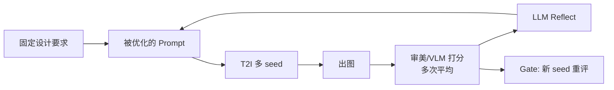
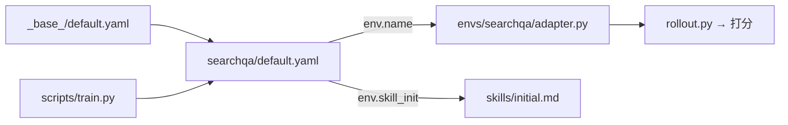
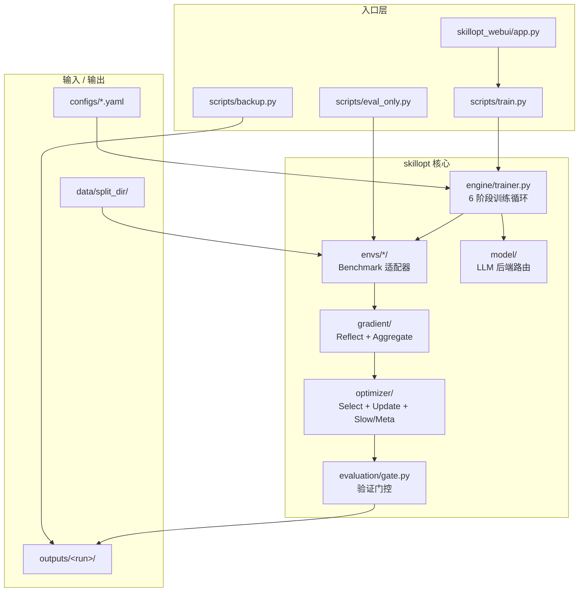

# prompt-opt：基于 SkillOpt 的文生图 Prompt 优化

*Fork 自 [Microsoft SkillOpt](https://github.com/microsoft/SkillOpt)。保留 Reflect + Gate 训练循环，改造为：**给定固定设计要求，迭代寻找最优文生图 prompt**。*

[](https://www.python.org/) [](LICENSE) [](https://github.com/microsoft/SkillOpt)

---

## 个人情况与偏好

> 维护者背景、算力条件与工程约束，供 Agent / 协作者对齐上下文。

### 1. 硬件与模型 API
- **身份**：字节跳动内部员工
- **本地硬件**：Intel i9-10980XE @3.0GHz（18 核 36 线程）+ NVIDIA RTX 4090 24GB + Windows x64
- **模型 API**：拥有字节内部 **LLM / VLM / T2I** 等 SOTA 模型调用权限；**成本几乎无约束**，开发调试鼓励高频、大吞吐调用
- **云端算力**：可申请 NVIDIA A100
- **调度倾向**：轻量与敏感调试走本地 4090；中大型训练 / 推理 / 微调走云端 A100
- **审美标准**：维护者有一套**自定义审美 rubric**，可对出图给出相对准确的分数（作为本项目主要 reward 来源）

### 2. 代码与架构原则
- **架构**：高内聚低耦合，SOLID；拒绝「能跑就行」的临时代码
- **文件头注释（强制）**：每个代码文件开头中文三要素 — **【功能描述】【输入】【输出】**
- **TCE 友好**：配置 / 密钥 / 环境信息经环境变量注入，严禁硬编码
- **`.gitignore` 完备**：虚拟环境、密钥、图片资产、数据集、大文件缓存不上云

### 3. 测试与 README 规范
- 测试脚本：参数置顶，自包含直跑，拒绝 `--mode=test` 式 Flag
- README：Mermaid 流程图、目录树 + 一句话释义、Inputs/Outputs、踩坑记录；重大改动即时同步

---

## 项目改造目标

### 当下：单需求 → 最优文生图 Prompt

| 维度 | 说明 |
|---|---|
| **要解决的问题** | 给定**固定**设计要求（主标题、副标题、其他约束），自动迭代找到**审美得分最高**的文生图 prompt |
| **优化对象** | **Prompt 文本本身**（SkillOpt 产物 `best_skill.md`）；**不是**设计要求 |
| **设计要求** | 定死作输入，不参与训练；可只有 1 条 brief |
| **奖励信号** | **实时在线**：当前 prompt → T2I（多 seed）→ 出图 → **自定义审美 / VLM 打分** → 多次取平均 |
| **Gate** | 不用另一套设计 brief；用**换一批 seed 重出图再打分**，防碰巧高分 |
| **工具链** | Prompt **直连 T2I**；Reflect 用 LLM 分析低分并改 prompt（**不**加一层 LLM 写 prompt） |



**固定输入示例：**

```json
{
  "id": "poster_main",
  "main_title": "夏日音乐节",
  "sub_title": "2026 · 北京站",
  "requirements": "赛博朋克；蓝紫主色；16:9；留主标题区"
}
```

**无需**预先构建 `(prompt, score)` 静态数据集；每步 reward 由 T2I + 打分**实时在线**产生。

**奖励数据从哪来（实时生成，非预先标注）：**

```
当前 prompt → T2I（N 个 seed）→ N 张图 → 审美/VLM 各打分 → 取平均 = 本步 reward
Reflect 用 seed 组 A；Gate 接受前用 seed 组 B 重评（同一条 brief，换 seed，非换设计稿）
```

每步产物 `(prompt_v, images[], scores[], mean_score)` 可落盘到 `outputs/`，供分析；**不必**事先攒静态训练集。

### 为何原项目要 train/val，本项目却不必？

| | 原 SkillOpt | 本项目（当下） |
|--|-------------|----------------|
| 优化对象 | 跨任务通用的 **Skill 写法** | **单条 T2I prompt 文本** |
| train 数据 | 很多**不同任务**（不同 QA 题等） | **1 条固定设计 brief 即可** |
| val 数据 | **换一批不同题目**，防 Skill 只会做 train 题 | **同一 brief + 换 seed 重出图**，防碰巧高分 |
| 奖励 | rollout 在线算（EM/F1、环境成功率） | rollout 在线算（T2I + 审美分，多 seed 平均） |
| 需要 gold prompt 吗 | 否 | **否** |

原项目要 train/val，是因为学的是**跨任务的泛化能力**；不是要你准备「若干同类文本 + 预先标好的最优 prompt」。  
本项目单需求场景：**不需要按设计稿切 train/val**；若框架目录结构要求 `train/`、`val/`，填同一条 brief 占位即可，语义上靠 `train_seeds` / `gate_seeds` 区分。

### 未来 TODO（暂不实现）

- 训练「**文生图 Prompt 生成能力**」Meta-Skill：多种不同设计要求下学会写 prompt
- 届时再恢复多 brief + 真 train/val 泛化

### 与原 SkillOpt 的差异

| | 原 SkillOpt | 本仓库 |
|--|-------------|--------|
| 优化对象 | 跨任务通用 Skill | **单需求 T2I prompt 文本** |
| 数据 | 很多不同任务 | **1 条 brief 即可** |
| 奖励 | EM/F1、环境成功率 | T2I 出图 + 审美分（多 seed 平均） |
| Target LLM | 必须 | **可省略**（prompt 直连 T2I） |

---

## configs 与 skillopt/envs 是什么？

**一句话：`configs/{name}/` = 实验配方（超参、路径）；`skillopt/envs/{name}/` = 运行逻辑（怎么 rollout、怎么打分、怎么 reflect）。** 文件夹名按 benchmark **一一对应**，通过 YAML 里的 `env.name` 绑定。

> 这些是 **Microsoft SkillOpt 原版** 为 6 种 benchmark 准备的；改造 T2I 时会新增 `t2i/`，其余可归档到 `backup/` 仅作参考。



| 目录 | 职责 |
|---|---|
| **`configs/_base_/`** | 全局默认超参（epoch、LR、gate、模型后端等） |
| **`configs/{benchmark}/`** | 某 benchmark 实验配方：继承 `_base_` 并覆盖 batch、workers、数据路径 |
| **`skillopt/envs/{benchmark}/`** | 运行逻辑：读数据 → rollout → 打分 → reflect |
| **`skillopt/envs/_template/`** | 新 benchmark 脚手架（改造时复制为 `t2i/`） |
| **`skillopt/envs/base.py`** | 所有 env 共同遵守的 `EnvAdapter` 接口 |

### configs/ 各文件夹（原版 benchmark，作参考）

| 文件夹 | 任务类型 |
|---|---|
| `_base_/` | 全局默认（非 benchmark） |
| `searchqa/` | 检索增强问答 |
| `alfworld/` | 具身智能 |
| `docvqa/` | 文档视觉问答 |
| `livemathematicianbench/` | 数学推理 |
| `spreadsheetbench/` | Excel 代码生成 |
| `officeqa/` | 办公工具 QA |

YAML 通过 `_base_: ../_base_/default.yaml` 继承；`env.name: searchqa` 绑定 `skillopt/envs/searchqa/`。

### skillopt/envs/ 各文件夹

每个子目录通常含：`adapter.py`（入口）、`dataloader.py`、`rollout.py`、`evaluator.py`、`prompts/`、`skills/initial.md`。

| 文件夹 | 特点 |
|---|---|
| `searchqa/` | 单轮 QA，结构最简，适合抄 adapter 模式 |
| `alfworld/` | 含 `vendor/`，具身环境 + 多轮 |
| `spreadsheetbench/` | codegen / react agent + 执行沙箱 |
| `officeqa/` | 工具调用 runtime |
| `_template/` | 新 env 模板 |

> **改造方向**：新增 `configs/t2i/` + `skillopt/envs/t2i/`；原版 6 套可逐步归档至 `backup/`。

---

## 项目结构

### 架构概览



### 目录树

```
prompt-opt/
├── configs/                    # 实验配置（YAML，支持 _base_ 继承）
│   ├── _base_/default.yaml     # 全局默认超参
│   └── {benchmark}/default.yaml
├── scripts/                    # CLI 入口
│   ├── train.py                # 训练主入口
│   ├── eval_only.py            # 仅评估已训练 skill
│   └── backup.py               # 归档/快照脚本
├── skillopt/                   # 核心 Python 包（日常开发主战场）
│   ├── config.py               # YAML 加载与扁平化
│   ├── types.py                # Pipeline 标准 I/O 类型定义
│   ├── engine/trainer.py       # ReflACT 训练循环编排
│   ├── datasets/base.py        # 任务批次采样 / split 抽象
│   ├── envs/                   # Benchmark 环境适配层
│   ├── gradient/               # ② Reflect ③ Aggregate
│   ├── optimizer/              # ④ Select ⑤ Update + LR / Slow / Meta
│   ├── evaluation/gate.py      # ⑥ 验证门控
│   ├── model/                  # LLM 后端路由
│   ├── prompts/                # Optimizer 通用 prompt 模板
│   └── utils/                  # JSON 解析、打分等工具
├── skillopt_webui/             # Gradio 训练过程可视化监控
├── backup/                     # 本地归档（.gitignore，不上云）
│   ├── archive/                # 日常少用的项目资产
│   │   ├── website/            # index.html、落地页静态资源
│   │   ├── docs_site/          # docs/、mkdocs.yml
│   │   ├── shell/              # run_*.sh 便捷脚本
│   │   └── misc/               # requirements.txt、空占位模块等
│   └── snapshots/              # outputs / data 运行产物快照
├── pyproject.toml              # 包定义与依赖
└── .env.example                # API 凭证环境变量模板
```

### backup 归档说明

日常开发保留 `configs/`、`scripts/`、`skillopt/`、`skillopt_webui/`。以下已归档到 `backup/archive/`：

| 分类 | 原路径 | 何时需要恢复 |
|---|---|---|
| `website/` | `index.html`、`skillopt-assets/` | 更新 GitHub Pages 落地页 |
| `docs_site/` | `docs/`、`mkdocs.yml` | 构建文档站 `mkdocs serve` |
| `shell/` | `scripts/run_*.sh` | 用 shell 快捷启动实验 |
| `misc/` | `requirements.txt`、`skillopt/scheduler/` | 兼容旧安装方式 |

归档 / 快照：修改 `scripts/backup.py` 顶部 `MODE` 后执行 `python scripts/backup.py`。

### 踩坑记录

| 问题 | 解法 |
|---|---|
| LLM 调用失败 | 检查字节内部 API / `.env` 环境变量是否注入 |
| 单 brief 无 val 语义 | `train/`、`val/` 填同一条占位；Gate 用 `gate_seeds` 区分 |
| 分数波动大 | 增大 T2I seed 数，取平均 / 中位数 |
| 归档后找不到 docs | 见 `backup/archive/docs_site/` |

### 项目级 Inputs / Outputs

| 类型 | 路径 / 说明 |
|---|---|
| **输入** | 固定设计要求 — `main_title` / `sub_title` / `requirements`（JSON 或配置注入） |
| **输入** | `skillopt/envs/t2i/skills/initial.md` — 初始 seed prompt（待建） |
| **输入** | `configs/t2i/default.yaml` — 超参、`train_seeds` / `gate_seeds` 等（待建） |
| **输入** | 字节内部 API — LLM（Reflect）、T2I（出图）、VLM / 审美模型（打分） |
| **输入** | `.env` — API 凭证（环境变量注入，禁止硬编码） |
| **输出** | `outputs/<run>/best_skill.md` — **最优 T2I prompt** |
| **输出** | `outputs/<run>/steps/step_XXXX/images/` — 各 seed 出图与分数 |
| **输出** | `outputs/<run>/history.json` — 逐步训练记录 |

> **无需**预先构建 `(prompt, score)` 静态数据集；每步 reward 由 T2I + 打分**实时**产生，多 seed 平均降方差。

> 运行产物目录 `outputs/`、`data/` 由 `scripts/backup.py` 快照到 `backup/snapshots/`（已在 `.gitignore`）。

---

## 安装

**环境要求：** Python 3.10+

```bash
git clone https://github.com/microsoft/SkillOpt.git
cd SkillOpt
pip install -e .

# ALFWorld 基准（可选）：
pip install -e ".[alfworld]"
alfworld-download
```

### 配置 API 凭证

```bash
cp .env.example .env
# 编辑 .env 填入 API 凭证，然后：
source .env
```

**Azure OpenAI**（推荐）：
```bash
export AZURE_OPENAI_ENDPOINT="https://your-resource.openai.azure.com/"
# 方式 1：API Key 认证
export AZURE_OPENAI_API_KEY="your-key"
# 方式 2：Azure CLI 认证（无需 API Key）
export AZURE_OPENAI_AUTH_MODE="azure_cli"
```

> **说明：** `AZURE_OPENAI_ENDPOINT` 为必填项。未配置时，所有 LLM 调用均会失败。

**OpenAI** 直连：
```bash
export OPENAI_API_KEY="sk-..."
```

**Anthropic Claude**：
```bash
export ANTHROPIC_API_KEY="sk-ant-..."
```

**Qwen（本地 vLLM）**：
```bash
export QWEN_CHAT_BASE_URL="http://localhost:8000/v1"
export QWEN_CHAT_MODEL="Qwen/Qwen3.5-4B"
```

---

## 数据准备

### 改造目标（T2I，单固定需求）

- **设计要求**：1 条 brief 即可；框架若要求 `split_dir`，`train/` 与 `val/` 可填**同一条**（仅占位）
- **奖励数据**：不预先标注；每轮 `prompt → T2I → 打分` 在线产生，`train_seeds` 用于 Reflect，`gate_seeds` 用于 Gate
- **hard / soft**：`soft = 审美分归一化`；`hard = 是否过阈值`（或令 `hard = soft`）

### 原版 benchmark 数据格式（参考）

原 SkillOpt 要求 `train/`、`val/`、`test/` 各含 `items.json`。SearchQA 示例见 `skillopt/envs/searchqa/dataloader.py`。配置与 env 对应关系见上文「configs 与 skillopt/envs」。

---

## 快速开始

### 训练

```bash
# 最小示例 — 在 SearchQA 上训练：
python scripts/train.py \
    --config configs/searchqa/default.yaml \
    --split_dir /path/to/your/searchqa_split \
    --azure_openai_endpoint https://your-resource.openai.azure.com/ \
    --optimizer_model gpt-5.5 \
    --target_model gpt-5.5

# 在 LiveMathematicianBench 上训练：
python scripts/train.py \
    --config configs/livemathematicianbench/default.yaml \
    --split_dir /path/to/your/livemath_split \
    --azure_openai_endpoint https://your-resource.openai.azure.com/ \
    --optimizer_model gpt-5.5 \
    --target_model gpt-5.5

# 在 ALFWorld 上训练：
python scripts/train.py \
    --config configs/alfworld/default.yaml \
    --split_dir /path/to/your/alfworld_split \
    --azure_openai_endpoint https://your-resource.openai.azure.com/ \
    --optimizer_model gpt-5.5 \
    --target_model gpt-5.5
```

主要 CLI 参数：

| 参数 | 说明 | 示例 |
|---|---|---|
| `--config` | 基准配置 YAML | `configs/searchqa/default.yaml` |
| `--split_dir` | 数据划分目录路径 | `/path/to/split` |
| `--azure_openai_endpoint` | Azure OpenAI 端点 URL | `https://your-resource.openai.azure.com/` |
| `--optimizer_model` | 优化器模型部署名 | `gpt-5.5` |
| `--target_model` | 目标模型部署名 | `gpt-5.5` |
| `--num_epochs` | 训练 epoch 数 | `4` |
| `--batch_size` | 每步 batch size | `40` |
| `--workers` | 并行 rollout worker 数 | `8` |
| `--out_root` | 输出目录 | `outputs/my_run` |

### 仅评估

在不训练的情况下，用已训练技能对指定数据划分做评估：

```bash
# 仅在测试集上评估：
python scripts/eval_only.py \
  --config configs/searchqa/default.yaml \
  --skill outputs/my_run/best_skill.md \
  --split valid_unseen \
  --split_dir /path/to/searchqa_split \
  --azure_openai_endpoint https://your-resource.openai.azure.com/

# 在所有划分上评估（train + val + test）：
python scripts/eval_only.py \
  --config configs/searchqa/default.yaml \
  --skill outputs/my_run/best_skill.md \
  --split all \
  --split_dir /path/to/searchqa_split \
  --azure_openai_endpoint https://your-resource.openai.azure.com/
```

| 划分 | 说明 |
|---|---|
| `valid_unseen` | 测试集 |
| `valid_seen` | 验证集 |
| `train` | 训练集 |
| `all` | 全部划分合并（默认） |

### 输出结构

每次运行写入结构化输出目录：

```
outputs/<run_name>/
├── config.json              # 扁平化运行时配置
├── history.json             # 逐步训练历史
├── runtime_state.json       # 断点续训检查点
├── best_skill.md            # 验证最优技能文档
├── skills/skill_vXXXX.md   # 每步技能快照
├── steps/step_XXXX/        # 每步产物（补丁、评估）
├── slow_update/epoch_XX/   # 慢更新日志
└── meta_skill/epoch_XX/    # 元技能日志
```

重复执行相同命令时，会从上次完成的步骤自动续训。

---

## WebUI

训练过程可视化面板，用于配置、启动训练并实时查看 step / epoch 进度与日志：

```bash
pip install -e ".[webui]"
python -m skillopt_webui.app
```

| 参数 | 默认值 | 说明 |
|---|---|---|
| `--port` | 7860 | 服务端口 |
| `--host` | `0.0.0.0` | 绑定地址 |
| `--share` | 关闭 | 创建 Gradio 公网分享链接 |

```bash
# 启用公网分享链接（适用于远程服务器）
python -m skillopt_webui.app --share
```

---

## 上游引用

本仓库训练循环源自 Microsoft SkillOpt — [arXiv:2605.23904](https://arxiv.org/abs/2605.23904)。 BibTeX 见 `backup/archive/docs_site/` 或上游仓库。
