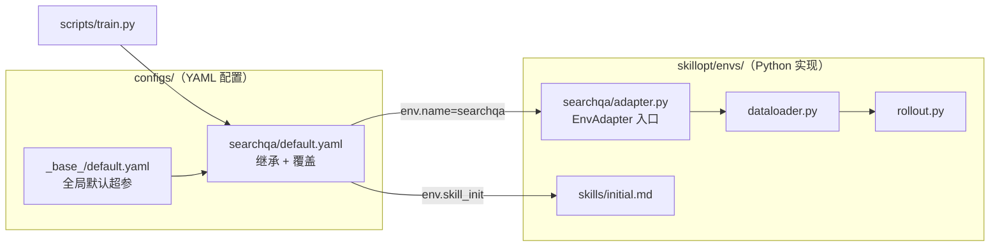
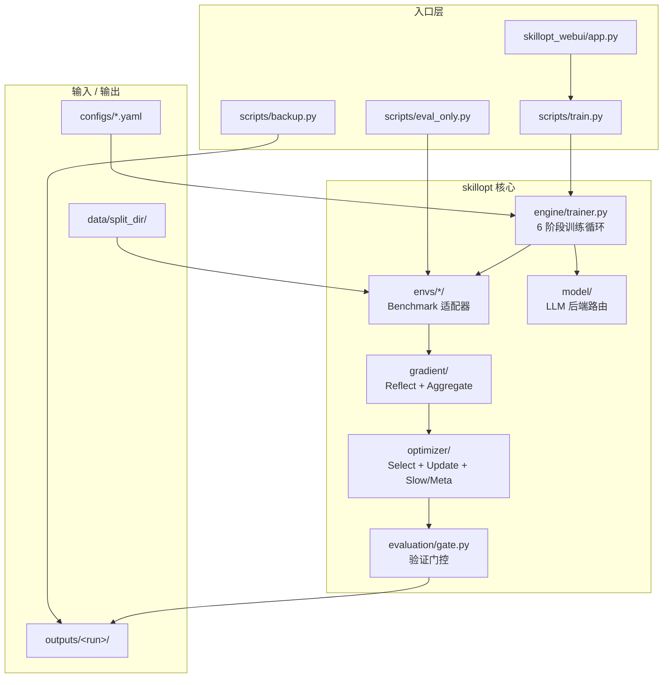

# SkillOpt: 自进化 Agent 技能的执行策略

*像训练神经网络一样训练 Agent 技能——使用 epoch、（mini-）batch size、学习率与验证门控——但无需改动模型权重。*

[](https://microsoft.github.io/SkillOpt/) [](https://arxiv.org/abs/2605.23904) [](https://youtu.be/JUBMDTCiM0M) [](https://www.python.org/) [](LICENSE)

## 🎬 SkillOpt 演示视频

https://github.com/user-attachments/assets/eb12d3bc-371c-467f-904d-91b61f339ed7

<p align="center">
  <a href="https://youtu.be/JUBMDTCiM0M"><b>▶ 在 YouTube 观看完整演示</b></a>
</p>

---

## 维护者环境与工程目标

> 本节记录本 fork 的维护者背景与改造方向，便于后续 Agent / 协作者对齐上下文。

### 个人环境与算力

| 项 | 配置 |
|---|---|
| **身份** | 字节跳动内部员工 |
| **本地硬件** | Intel i9-10980XE（18C/36T）+ NVIDIA RTX 4090 24GB，Windows x64 |
| **模型 API** | 字节内部 SOTA 模型全量调用权限，开发调试成本约束宽松 |
| **云端算力** | 可申请 NVIDIA A100 |
| **调度策略** | 轻量 / 敏感调试 → 本地 4090；中大型训练 / 推理 / 微调 → 云端 A100 |

### 本项目改造目标

1. **基于 SkillOpt 做 Agent Skill 自进化训练**：保留 ReflACT 六阶段循环 + WebUI 可视化，聚焦可复现实验与工程化落地。
2. **拒绝「能跑就行」**：高内聚低耦合，严格 SOLID；模块职责单一、命名自解释，不写临时代码。
3. **TCE 友好部署**：配置 / 密钥 / 环境信息一律环境变量注入，严禁硬编码；`.gitignore` 完备，不上传数据、密钥、本地缓存。
4. **代码规范**：每个 `.py` 文件头注释三要素（功能描述 / 输入 / 输出）；测试与工具脚本参数置顶，自包含直跑。
5. **目录整洁**：核心开发保留 `configs/`、`skillopt/`、`scripts/`、`skillopt_webui/`；落地页、文档站等归档至 `backup/archive/`。

### README 维护约定

架构调整、核心依赖或接口变更时同步更新本文档；保持 Mermaid 流程图、目录树、Inputs/Outputs、踩坑记录四要素精炼可用。

---

## configs 与 skillopt/envs 是什么关系？

**一句话：`configs/{benchmark}/` 管「怎么训」，`skillopt/envs/{benchmark}/` 管「训什么任务、怎么跑」。** 两者按 benchmark 名称 **一一对应**，共 6 套。



| 目录 | 职责 | 改什么场景 |
|---|---|---|
| **`configs/_base_/`** | 所有实验共享的默认超参（模型、epoch、LR、gate 等） | 调全局默认值 |
| **`configs/{benchmark}/`** | 某个 benchmark 的实验配方：继承 `_base_`，覆盖 batch、workers、数据路径等 | 开新实验、改超参 |
| **`skillopt/envs/{benchmark}/`** | 该 benchmark 的**全部运行逻辑**：读数据、执行任务、打分、反思 | 换任务格式、改 agent 行为、加工具 |
| **`skillopt/envs/_template/`** | 新增 benchmark 的脚手架（复制改名即可） | 接入新数据集 / 新环境 |
| **`skillopt/envs/base.py`** | 所有 benchmark 共同遵守的 `EnvAdapter` 接口 | 一般不动 |

### configs/ 每个文件夹

| 文件夹 | 对应任务类型 | 配置文件 |
|---|---|---|
| `_base_/` | （非 benchmark）全局默认 | `default.yaml` |
| `searchqa/` | 检索增强问答 | `default.yaml` |
| `alfworld/` | 具身智能文本环境 | `default.yaml` |
| `docvqa/` | 文档视觉问答 | `default.yaml` |
| `livemathematicianbench/` | 数学推理 | `default.yaml` |
| `spreadsheetbench/` | Excel 代码生成 / ReAct | `default.yaml` |
| `officeqa/` | 办公场景工具调用 QA | `default.yaml` |

YAML 典型结构（继承链：`configs/searchqa/default.yaml` → `_base_/default.yaml`）：

```yaml
_base_: ../_base_/default.yaml   # 继承全局默认
train:
  batch_size: 40                 # 覆盖训练超参
env:
  name: searchqa                   # 绑定 skillopt/envs/searchqa/
  skill_init: skillopt/envs/searchqa/skills/initial.md
  split_dir: data/searchqa_split
```

### skillopt/envs/ 每个文件夹

| 文件夹 | 核心代码 | 特有内容 |
|---|---|---|
| `searchqa/` | adapter + dataloader + rollout + reflect | 单轮 QA |
| `alfworld/` | 同上 + `vendor/` | 具身环境封装、记忆与多轮 prompt |
| `docvqa/` | adapter + dataloader + rollout | 文档 QA |
| `livemathematicianbench/` | 同上 + reflect | 数学任务 |
| `spreadsheetbench/` | codegen_agent / react_agent / executor | Excel 执行沙箱 |
| `officeqa/` | tool_runtime | 办公工具调用 |
| `_template/` | 模板文件 | 新 benchmark 复制起点 |

每个 env 子目录内部约定：

| 文件 / 目录 | 职责 |
|---|---|
| `adapter.py` | 实现 `EnvAdapter`，trainer 唯一入口 |
| `dataloader.py` | 解析 `split_dir` 数据，生成 batch |
| `rollout.py` | Target 模型执行任务 → 轨迹 + 分数 |
| `reflect.py` | （可选）环境专属反思；缺省走通用 `gradient/reflect.py` |
| `evaluator.py` | hard/soft 打分规则 |
| `prompts/` | 该 benchmark 专用 prompt |
| `skills/initial.md` | 训练起点 skill 文档 |

> **为何分两套目录？** 配置（YAML）与实现（Python）解耦：调参不改代码，换任务逻辑不改全局默认；新增 benchmark 只需各加一个 `configs/xxx/` + `skillopt/envs/xxx/`。

---

## 项目结构

### 架构概览



### 目录树

```
prompt-opt/
├── configs/                    # 实验配置（YAML，支持 _base_ 继承）
│   ├── _base_/default.yaml     # 全局默认超参
│   └── {benchmark}/default.yaml
├── scripts/                    # CLI 入口
│   ├── train.py                # 训练主入口
│   ├── eval_only.py            # 仅评估已训练 skill
│   └── backup.py               # 归档/快照脚本
├── skillopt/                   # 核心 Python 包（日常开发主战场）
│   ├── config.py               # YAML 加载与扁平化
│   ├── types.py                # Pipeline 标准 I/O 类型定义
│   ├── engine/trainer.py       # ReflACT 训练循环编排
│   ├── datasets/base.py        # 任务批次采样 / split 抽象
│   ├── envs/                   # Benchmark 环境适配层
│   ├── gradient/               # ② Reflect ③ Aggregate
│   ├── optimizer/              # ④ Select ⑤ Update + LR / Slow / Meta
│   ├── evaluation/gate.py      # ⑥ 验证门控
│   ├── model/                  # LLM 后端路由
│   ├── prompts/                # Optimizer 通用 prompt 模板
│   └── utils/                  # JSON 解析、打分等工具
├── skillopt_webui/             # Gradio 训练过程可视化监控
├── backup/                     # 本地归档（.gitignore，不上云）
│   ├── archive/                # 日常少用的项目资产
│   │   ├── website/            # index.html、落地页静态资源
│   │   ├── docs_site/          # docs/、mkdocs.yml
│   │   ├── shell/              # run_*.sh 便捷脚本
│   │   └── misc/               # requirements.txt、空占位模块等
│   └── snapshots/              # outputs / data 运行产物快照
├── pyproject.toml              # 包定义与依赖
└── .env.example                # API 凭证环境变量模板
```

### backup 归档说明

日常开发保留 `configs/`、`scripts/`、`skillopt/`、`skillopt_webui/`。以下已归档到 `backup/archive/`：

| 分类 | 原路径 | 何时需要恢复 |
|---|---|---|
| `website/` | `index.html`、`skillopt-assets/` | 更新 GitHub Pages 落地页 |
| `docs_site/` | `docs/`、`mkdocs.yml` | 构建文档站 `mkdocs serve` |
| `shell/` | `scripts/run_*.sh` | 用 shell 快捷启动实验 |
| `misc/` | `requirements.txt`、`skillopt/scheduler/` | 兼容旧安装方式 |

归档 / 快照：修改 `scripts/backup.py` 顶部 `MODE` 后执行 `python scripts/backup.py`。

### 项目级 Inputs / Outputs

| 类型 | 路径 / 说明 |
|---|---|
| **输入** | `configs/{benchmark}/default.yaml` — 超参与模型配置 |
| **输入** | `data/{split}/train\|val\|test/items.json` — 任务数据 |
| **输入** | `.env` — `AZURE_OPENAI_ENDPOINT` 等 API 凭证 |
| **输入** | `skillopt/envs/{benchmark}/skills/initial.md` — 初始 skill |
| **输出** | `outputs/<run>/best_skill.md` — 验证集最优 skill |
| **输出** | `outputs/<run>/skills/skill_vXXXX.md` — 每步 skill 快照 |
| **输出** | `outputs/<run>/history.json` — 逐步训练记录 |
| **输出** | `outputs/<run>/steps/step_XXXX/` — 每步 patch / eval 产物 |

> 运行产物目录 `outputs/`、`data/` 由 `scripts/backup.py` 快照到 `backup/snapshots/`（已在 `.gitignore`）。

### 踩坑记录

| 问题 | 解法 |
|---|---|
| LLM 全部失败 | 检查 `AZURE_OPENAI_ENDPOINT` 或字节内部 API 环境变量是否注入 |
| `train_size` 报错 | 在对应 `configs/*/default.yaml` 的 `train.train_size` 填写，或确保 `split_dir` 数据可加载 |
| WebUI 看不到进度 | 确认 `out_root` 与训练脚本一致；训练需写入 `outputs/<run>/history.json` |
| 本地 4090 跑大 batch OOM | 降低 `batch_size` / `workers`，或改走云端 A100 |
| 归档后找不到 docs / 落地页 | 从 `backup/archive/` 对应分类移回原路径 |

---

## 安装

**环境要求：** Python 3.10+

```bash
git clone https://github.com/microsoft/SkillOpt.git
cd SkillOpt
pip install -e .

# ALFWorld 基准（可选）：
pip install -e ".[alfworld]"
alfworld-download
```

### 配置 API 凭证

```bash
cp .env.example .env
# 编辑 .env 填入 API 凭证，然后：
source .env
```

**Azure OpenAI**（推荐）：
```bash
export AZURE_OPENAI_ENDPOINT="https://your-resource.openai.azure.com/"
# 方式 1：API Key 认证
export AZURE_OPENAI_API_KEY="your-key"
# 方式 2：Azure CLI 认证（无需 API Key）
export AZURE_OPENAI_AUTH_MODE="azure_cli"
```

> **说明：** `AZURE_OPENAI_ENDPOINT` 为必填项。未配置时，所有 LLM 调用均会失败。

**OpenAI** 直连：
```bash
export OPENAI_API_KEY="sk-..."
```

**Anthropic Claude**：
```bash
export ANTHROPIC_API_KEY="sk-ant-..."
```

**Qwen（本地 vLLM）**：
```bash
export QWEN_CHAT_BASE_URL="http://localhost:8000/v1"
export QWEN_CHAT_MODEL="Qwen/Qwen3.5-4B"
```

---

## 数据准备

SkillOpt 要求数据组织为**划分目录**，包含 `train/`、`val/`、`test/` 子目录，各子目录内放置 JSON 文件（如 `items.json`）。

```
data/my_split/
├── train/items.json
├── val/items.json
└── test/items.json
```

每个 JSON 文件为任务项数组。必填字段因基准而异。SearchQA 示例如下：

```json
[
  {
    "id": "unique_item_id",
    "question": "Who wrote the novel ...",
    "context": "[DOC] relevant passage text ...",
    "answers": ["expected answer"]
  }
]
```

各基准的精确格式见 `skillopt/envs/<benchmark>/dataloader.py`。

> **说明：** 本仓库不包含基准数据集。请按上述格式自行准备数据。

### 支持的基准

| 基准 | 类型 | 配置 |
|---|---|---|
| SearchQA | 问答 | `configs/searchqa/default.yaml` |
| ALFWorld | 具身智能体 | `configs/alfworld/default.yaml` |
| DocVQA | 文档问答 | `configs/docvqa/default.yaml` |
| LiveMathematicianBench | 数学 | `configs/livemathematicianbench/default.yaml` |
| SpreadsheetBench | 代码生成 | `configs/spreadsheetbench/default.yaml` |
| OfficeQA | 工具增强问答 | `configs/officeqa/default.yaml` |

---

## 快速开始

### 训练

```bash
# 最小示例 — 在 SearchQA 上训练：
python scripts/train.py \
    --config configs/searchqa/default.yaml \
    --split_dir /path/to/your/searchqa_split \
    --azure_openai_endpoint https://your-resource.openai.azure.com/ \
    --optimizer_model gpt-5.5 \
    --target_model gpt-5.5

# 在 LiveMathematicianBench 上训练：
python scripts/train.py \
    --config configs/livemathematicianbench/default.yaml \
    --split_dir /path/to/your/livemath_split \
    --azure_openai_endpoint https://your-resource.openai.azure.com/ \
    --optimizer_model gpt-5.5 \
    --target_model gpt-5.5

# 在 ALFWorld 上训练：
python scripts/train.py \
    --config configs/alfworld/default.yaml \
    --split_dir /path/to/your/alfworld_split \
    --azure_openai_endpoint https://your-resource.openai.azure.com/ \
    --optimizer_model gpt-5.5 \
    --target_model gpt-5.5
```

主要 CLI 参数：

| 参数 | 说明 | 示例 |
|---|---|---|
| `--config` | 基准配置 YAML | `configs/searchqa/default.yaml` |
| `--split_dir` | 数据划分目录路径 | `/path/to/split` |
| `--azure_openai_endpoint` | Azure OpenAI 端点 URL | `https://your-resource.openai.azure.com/` |
| `--optimizer_model` | 优化器模型部署名 | `gpt-5.5` |
| `--target_model` | 目标模型部署名 | `gpt-5.5` |
| `--num_epochs` | 训练 epoch 数 | `4` |
| `--batch_size` | 每步 batch size | `40` |
| `--workers` | 并行 rollout worker 数 | `8` |
| `--out_root` | 输出目录 | `outputs/my_run` |

### 仅评估

在不训练的情况下，用已训练技能对指定数据划分做评估：

```bash
# 仅在测试集上评估：
python scripts/eval_only.py \
  --config configs/searchqa/default.yaml \
  --skill outputs/my_run/best_skill.md \
  --split valid_unseen \
  --split_dir /path/to/searchqa_split \
  --azure_openai_endpoint https://your-resource.openai.azure.com/

# 在所有划分上评估（train + val + test）：
python scripts/eval_only.py \
  --config configs/searchqa/default.yaml \
  --skill outputs/my_run/best_skill.md \
  --split all \
  --split_dir /path/to/searchqa_split \
  --azure_openai_endpoint https://your-resource.openai.azure.com/
```

| 划分 | 说明 |
|---|---|
| `valid_unseen` | 测试集 |
| `valid_seen` | 验证集 |
| `train` | 训练集 |
| `all` | 全部划分合并（默认） |

### 输出结构

每次运行写入结构化输出目录：

```
outputs/<run_name>/
├── config.json              # 扁平化运行时配置
├── history.json             # 逐步训练历史
├── runtime_state.json       # 断点续训检查点
├── best_skill.md            # 验证最优技能文档
├── skills/skill_vXXXX.md   # 每步技能快照
├── steps/step_XXXX/        # 每步产物（补丁、评估）
├── slow_update/epoch_XX/   # 慢更新日志
└── meta_skill/epoch_XX/    # 元技能日志
```

重复执行相同命令时，会从上次完成的步骤自动续训。

---

## WebUI

训练过程可视化面板，用于配置、启动训练并实时查看 step / epoch 进度与日志：

```bash
pip install -e ".[webui]"
python -m skillopt_webui.app
```

| 参数 | 默认值 | 说明 |
|---|---|---|
| `--port` | 7860 | 服务端口 |
| `--host` | `0.0.0.0` | 绑定地址 |
| `--share` | 关闭 | 创建 Gradio 公网分享链接 |

```bash
# 启用公网分享链接（适用于远程服务器）
python -m skillopt_webui.app --share
```

---

## 引用

```bibtex
@misc{yang2026skilloptexecutivestrategyselfevolving,
      title={SkillOpt: Executive Strategy for Self-Evolving Agent Skills}, 
      author={Yifan Yang and Ziyang Gong and Weiquan Huang and Qihao Yang and Ziwei Zhou and Zisu Huang and Yan Li and Xuemei Gao and Qi Dai and Bei Liu and Kai Qiu and Yuqing Yang and Dongdong Chen and Xue Yang and Chong Luo},
      year={2026},
      eprint={2605.23904},
      archivePrefix={arXiv},
      primaryClass={cs.AI},
      url={https://arxiv.org/abs/2605.23904}
}
```
