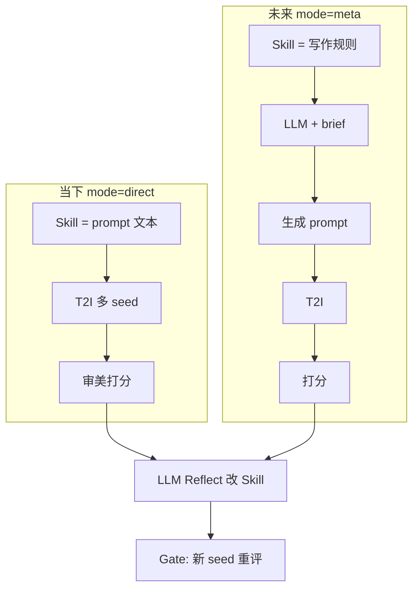
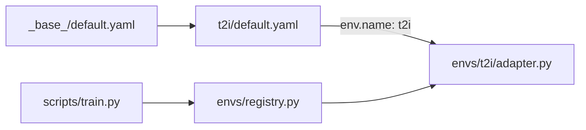

# prompt-opt：基于 SkillOpt 的文生图 Prompt 优化

*Fork 自 [Microsoft SkillOpt](https://github.com/microsoft/SkillOpt)。保留 Reflect + Gate 训练循环，改造为 T2I prompt 迭代优化。*

[](https://www.python.org/) [](LICENSE) [](https://github.com/microsoft/SkillOpt)

---

## 个人情况与偏好

> 维护者背景、算力条件与工程约束，供 Agent / 协作者对齐上下文。

### 1. 硬件与模型 API
- **身份**：字节跳动内部员工
- **本地硬件**：Intel i9-10980XE @3.0GHz（18 核 36 线程）+ NVIDIA RTX 4090 24GB + Windows x64
- **模型 API**：拥有字节内部 **LLM / VLM / T2I** 等 SOTA 模型调用权限；**成本几乎无约束**，开发调试鼓励高频、大吞吐调用
- **云端算力**：可申请 NVIDIA A100
- **调度倾向**：轻量与敏感调试走本地 4090；中大型训练 / 推理 / 微调走云端 A100
- **审美标准**：维护者有一套**自定义审美 rubric**，可对出图给出相对准确的分数（作为本项目主要 reward 来源）

### 2. 代码与架构原则
- **架构**：高内聚低耦合，SOLID；拒绝「能跑就行」的临时代码
- **文件头注释（强制）**：每个代码文件开头中文三要素 — **【功能描述】【输入】【输出】**
- **TCE 友好**：配置 / 密钥 / 环境信息经环境变量注入，严禁硬编码
- **`.gitignore` 完备**：虚拟环境、密钥、图片资产、数据集、大文件缓存不上云

### 3. 测试与 README 规范
- 测试脚本：参数置顶，自包含直跑，拒绝 `--mode=test` 式 Flag
- README：Mermaid 流程图、目录树 + 一句话释义、Inputs/Outputs、踩坑记录；重大改动即时同步

---

## 两种运行模式

> 同一套 Reflect + Gate 训练循环；差别在 **Skill 文档语义** 与 **rollout 链路**。

| 模式 | Skill 文档是什么 | Rollout 链路 | 状态 |
|---|---|---|---|
| **当下模式 `direct`** | **Skill 文档 = T2I prompt 本体** → 直连 T2I | prompt → T2I（多 seed）→ 审美打分 | **当前目标** |
| **未来模式 `meta`** | **Skill 文档 = 写 prompt 的规则** → LLM(Skill + brief) → prompt → T2I → 打分 | 多一层 LLM 将设计要求转为 prompt | **TODO** |



配置项：`configs/t2i/default.yaml` → `env.mode: direct | meta`（`meta` 待实现）。

---

## 项目改造目标

### 当下：单需求 → 最优文生图 Prompt

| 维度 | 说明 |
|---|---|
| **要解决的问题** | 给定**固定**设计要求（主标题、副标题、其他约束），自动迭代找到**审美得分最高**的文生图 prompt |
| **优化对象** | **Prompt 文本本身**（产物 `best_skill.md`）；**不是**设计要求 |
| **设计要求** | 定死作输入，不参与训练；可只有 1 条 brief |
| **奖励信号** | **实时在线**：当前 prompt → T2I（多 seed）→ 出图 → 审美 / VLM 打分 → 多次取平均 |
| **Gate** | 同一条 brief + **换 seed 重出图再打分**，防碰巧高分 |
| **工具链** | **当下模式**：prompt 直连 T2I；Reflect 用 LLM 分析低分并改 prompt |

**固定输入示例：**

```json
{
  "id": "poster_main",
  "main_title": "夏日音乐节",
  "sub_title": "2026 · 北京站",
  "requirements": "赛博朋克；蓝紫主色；16:9；留主标题区"
}
```

**奖励数据（实时生成，非预先标注）：**

```
当前 prompt → T2I（N 个 seed）→ N 张图 → 审美打分 → 取平均 = 本步 reward
Reflect 用 seed 组 A；Gate 用 seed 组 B（同 brief，换 seed）
```

**无需**预先构建 `(prompt, score)` 静态数据集。

### 为何不需要「按设计稿切 train/val」？

| | 原 SkillOpt（多 benchmark） | 本项目（当下） |
|--|-------------|----------------|
| 优化对象 | 跨任务通用 Skill | 单条 T2I prompt |
| train / val | 不同题目，防泛化失败 | **同一 brief**；靠 `train_seeds` / `gate_seeds` 区分 |
| 奖励 | EM/F1、环境成功率 | T2I + 审美分（多 seed 平均） |

原项目 6 套 benchmark（SearchQA、ALFWorld 等）已从主目录移除，归档于 `backup/archive/benchmarks/`。**日常开发不需要它们**；扩展机制见下文。

---

## configs 与 skillopt/envs

**`configs/{name}/`** = 实验配方（超参、路径）；**`skillopt/envs/{name}/`** = rollout / 打分 / reflect 逻辑。YAML 中 `env.name` 绑定 adapter。



| 路径 | 职责 |
|---|---|
| `configs/_base_/default.yaml` | 全局默认超参 |
| `configs/t2i/default.yaml` | T2I prompt 优化配方（`mode: direct`） |
| `skillopt/envs/t2i/` | T2I 环境（**待实现**） |
| `skillopt/envs/base.py` | `EnvAdapter` 接口 |
| `skillopt/envs/registry.py` | env 注册表 |
| `skillopt/envs/_template/` | 新 env 脚手架 |

### 扩展 Benchmark（保留可能性）

新增 env 三步：

1. 复制 `_template/` → `skillopt/envs/{name}/`，实现 `adapter / rollout / evaluator`
2. 新增 `configs/{name}/default.yaml`，设置 `env.name: {name}`
3. 在 `skillopt/envs/registry.py` 的 `_BUILTIN_ENVS` 追加一行，或运行时 `register_env()`

原版 6 套 benchmark 参考代码：`backup/archive/benchmarks/`。

---

## 项目结构

```
prompt-opt/
├── configs/
│   ├── _base_/default.yaml
│   └── t2i/default.yaml
├── scripts/
│   ├── train.py
│   ├── eval_only.py
│   └── backup.py
├── skillopt/
│   ├── engine/trainer.py       # Reflect + Gate 训练循环
│   ├── optimizer/ gradient/ evaluation/
│   ├── model/ prompts/ utils/
│   └── envs/
│       ├── base.py registry.py
│       ├── _template/
│       └── t2i/                # 待实现
├── skillopt_webui/             # 可选 Gradio 监控
├── backup/archive/
│   ├── benchmarks/             # 原版 6 套 benchmark + configs
│   ├── docs_site/ website/ shell/ misc/
│   └── ...
├── pyproject.toml
└── .env.example
```

### 踩坑记录

| 问题 | 解法 |
|---|---|
| `Unknown environment 't2i'` | 实现 `skillopt/envs/t2i/` 并在 registry 注册 |
| 单 brief 无 val 语义 | `train/`、`val/` 填同一条；Gate 用 `gate_seeds` |
| 分数波动大 | 增大 seed 数，取平均 / 中位数 |
| 找原版 SearchQA 等 | `backup/archive/benchmarks/` |

### Inputs / Outputs

| 类型 | 说明 |
|---|---|
| **输入** | 固定设计要求 JSON；`skillopt/envs/t2i/skills/initial.md` seed prompt |
| **输入** | `configs/t2i/default.yaml`；字节 LLM / T2I / VLM API（`.env`） |
| **输出** | `outputs/<run>/best_skill.md` — **最优 T2I prompt** |
| **输出** | `outputs/<run>/steps/step_XXXX/` — 出图、分数、Reflect 轨迹 |

---

## 安装

**环境要求：** Python 3.10+

```bash
cd prompt-opt
pip install -e .
# 可选 WebUI：pip install -e ".[webui]"
```

```bash
cp .env.example .env
# 填入字节内部 LLM / T2I / VLM API 凭证（环境变量注入）
```

---

## 快速开始

> `skillopt/envs/t2i/` 实现完成后即可运行。

```bash
python scripts/train.py \
    --config configs/t2i/default.yaml \
    --split_dir data/t2i_split \
    --out_root outputs/t2i_run
```

| 参数 | 说明 |
|---|---|
| `--config` | 配置 YAML |
| `--split_dir` | 含 `train/`、`val/` 的目录（单 brief 可两边填同一条） |
| `--out_root` | 输出目录 |
| `--num_epochs` | 训练轮数 |

产物 **`outputs/<run>/best_skill.md`** 即为最优 prompt 文本。

### 输出结构

```
outputs/<run>/
├── best_skill.md            # 最优 prompt
├── history.json
├── runtime_state.json       # 断点续训
└── steps/step_XXXX/         # 出图、分数、patch
```

---

## WebUI（可选）

```bash
pip install -e ".[webui]"
python -m skillopt_webui.app
```

---

## 上游引用

训练循环源自 Microsoft SkillOpt — [arXiv:2605.23904](https://arxiv.org/abs/2605.23904)。原版 benchmark 与文档见 `backup/archive/`。
