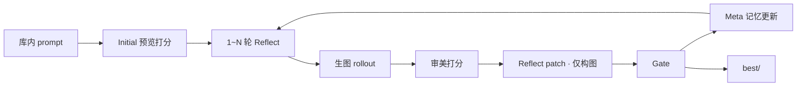

# prompt-opt：T2I Prompt 审美闭环优化

库内初始 prompt → Reflect + Gate（仅改【画面构图】）→ 输出历史最高分 prompt。  
依赖 **api-core**（LLM/生图）与 **aesthetic-core**（审美打分）。

## 流程



## 目录

```text
prompt-opt/
├── data/kv_synth_prompts_100_only.json  # 初始 prompt 库（字符串数组）
├── scripts/run_t2i.py                   # 唯一入口，顶部改配置
├── promptopt/
│   ├── prompts/               # Reflect / Merge / Rank / Meta 模板
│   ├── templates.py           # 模板加载与填充
│   ├── cases.py               # 随机选取库内 prompt
│   ├── trajectory.py          # 审美结果 → 轨迹文本
│   ├── runtime_config.py      # 默认参数
│   ├── types.py               # Edit / Patch / RolloutResult
│   ├── clients/               # api-core / aesthetic-core 桥接
│   ├── engine/runner.py       # 主循环
│   ├── gradient/              # reflect + merge
│   ├── optimizer/             # rank + apply patch（锁定核心特征/画面风格）
│   ├── evaluation/gate.py     # Gate 纯分数比较
│   ├── model/                 # api_core LLM 后端
│   └── utils/                 # JSON 解析、打分
├── pyproject.toml
└── outputs/                   # 运行产物（gitignore）
```

## 运行

```bash
pip install -e .
pip install -e D:\kv-generator\engines\aesthetic-core

python scripts/run_t2i.py
```

改 `scripts/run_t2i.py` 顶部：`MAX_ROUNDS`、`TRAIN_RUNS`、`CASE_SEED` 等。

训练结束自动生成 `report.html`；`OPEN_REPORT=True`（默认）会用系统浏览器打开。

## 优化范围

- **锁定**：【核心特征】【画面风格】（模板约束 + `prompt_editor` 硬跳过）
- **可改**：仅【画面构图】内局部 `replace` / `insert_after`

## Meta Prompt（跨轮记忆）

每轮 Gate 结束后，LLM 根据近期轮次摘要滚动更新 `meta_prompt_content`，下一轮 Reflect / Merge / Rank 通过 `## 优化器记忆` 注入，避免重复试错。

产物：`outputs/t2i_<ts>/meta_prompt.json`，每轮 `rounds/round_XXX/meta_prompt.json`。

## 产物

```text
outputs/t2i_<timestamp>/
├── case.json                  # 选用的库内 prompt 元信息（index）
├── initial_prompt.txt
├── config.json
├── templates.json
├── initial/                   # 初始 prompt + image + score
├── meta_prompt.json           # 最终跨轮记忆
├── report.html                # 训练可视化报告（自动生成）
├── rounds/round_XXX/          # 每轮 input / rollout / patch / gate / meta_prompt.json
├── best/                      # 历史最高分 prompt + image + score
└── summary.json
```

## 踩坑

- **Gate reject**：`current_score` 初始为 Initial 预览图分，非 rollout 均分；候选需超过该基准才 accept。
- **无三段标题的 prompt**：模板仍要求只改构图相关描述；硬保护仅在存在【核心特征】/【画面风格】标题时生效。
- **Windows 中文乱码**：patch JSON 须 `encoding="utf-8"` 写入（已修）。
- **aesthetic-core**：须单独 `pip install -e` 到本地引擎路径。
